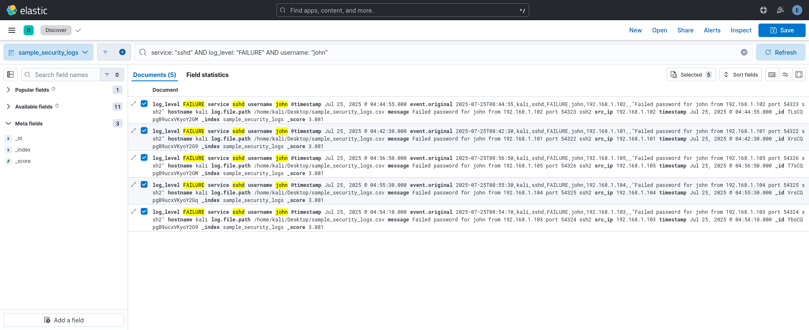
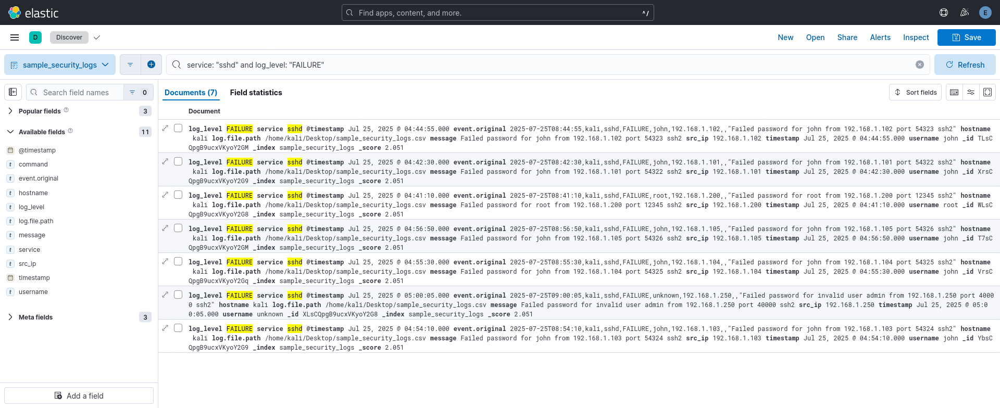
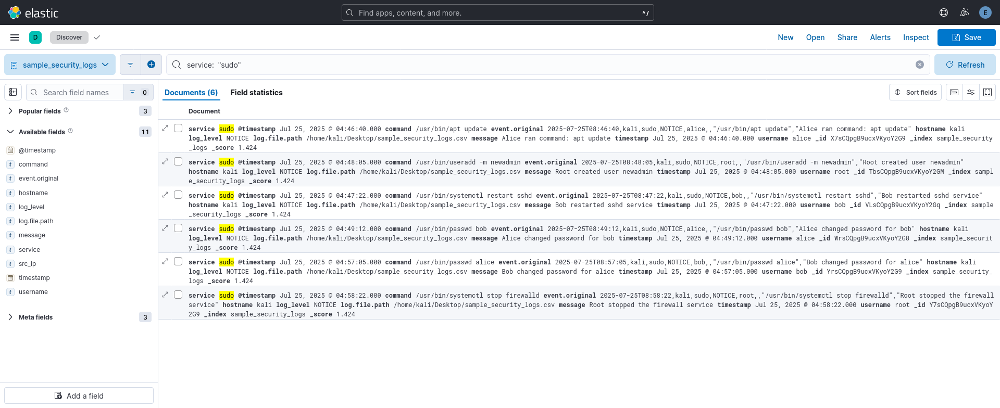
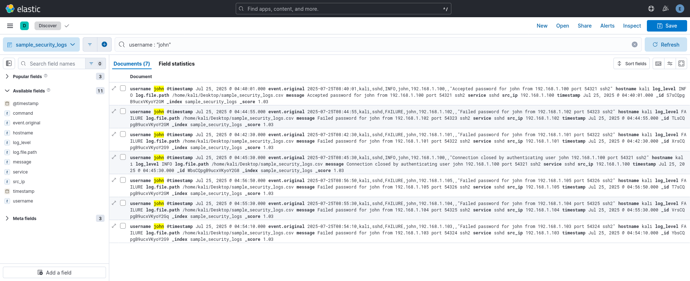
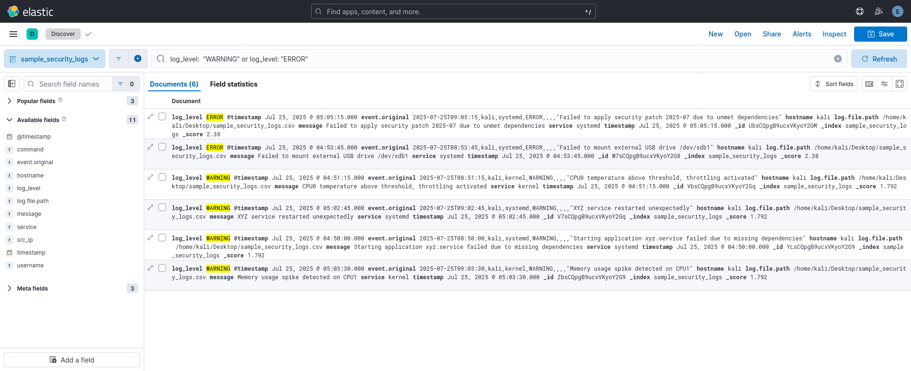
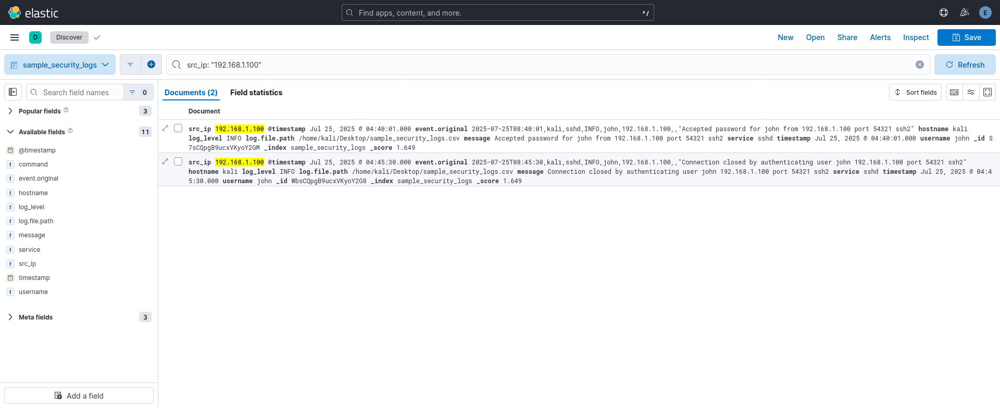
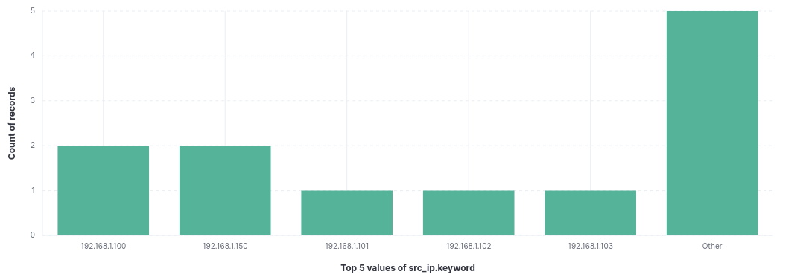
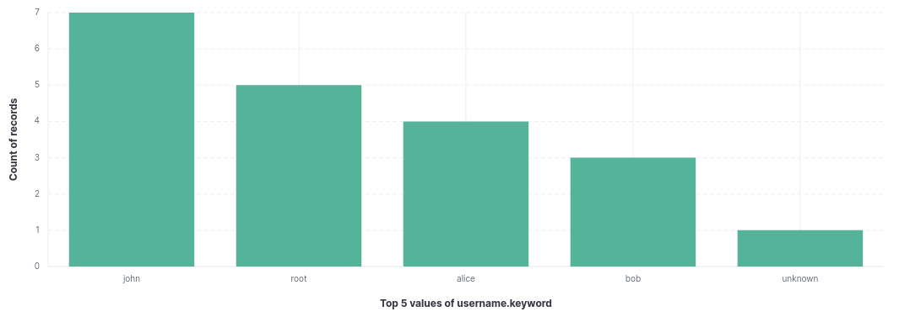
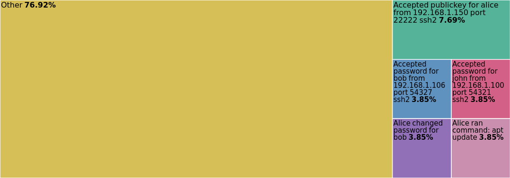

 
# Content Map

- [Summary](#summary)
- [Environment Setup](#environment-setup)
  - [Prerequisites](#prerequisites)
  - [Services to Enable and Start](#services-to-enable-and-start)
  - [Configuration](#configuration)
  - [Verification](#verification)
  - [Security](#security)
- [How the investigation was done](#how-the-investigation-was-done)
- [Incident Summary](#incident-summary)
- [Detailed Incident Report](#detailed-incident-report)
- [Appendix (Example Kibana Queries & Images)](#appendix-example-kibana-queries--images)
- [Visualizations and Graphs](#visualizations-and-graphs)
- [Mitigation](#mitigation)
- [Conclusion](#conclusion)


# Summary

This task involved monitoring security alerts using the Elastic Stack (Elasticsearch, Logstash, Kibana, Filebeat) on Kali Linux. The objective was to analyze log data, detect suspicious events, classify incidents, and document findings in a structured incident response report.
# Environment Setup 

## Prerequisites
- Kali Linux machine with internet access
- Minimum 4 GB RAM recommended

## Services to Enable and Start
- **Elasticsearch**  
  Ensure it is running and enabled to start at boot.
- **Logstash**  
  Configure your Logstash pipeline for CSV log ingestion.  
  Start and enable the service.
- **Kibana**  
  Start and enable Kibana service.  
  Access UI at `http://localhost:5601`.
- **Filebeat**  
  Enable the system module for shipping system logs.  
  Setup, start, and enable the Filebeat service.
## Configuration

- Place your CSV log files in a known directory (e.g., `/tmp/sample_security_logs.csv`).
- Create a Logstash pipeline config file to parse CSV logs, handle timestamps, and output to Elasticsearch.
- Create an index pattern in Kibana to match your log index (e.g., `sample_security_logs*`) with `@timestamp` as the time field.

## Verification

- Use `systemctl status` to verify all services are active.
- Confirm Elasticsearch is reachable before ingesting.
- Confirm logs appear in Kibana Discover under your index pattern.

## Security

- If security is enabled, configure authentication credentials in Logstash and Kibana.
- Use the `elastic` user or custom users accordingly.

---


# How the investigation was done

- Logs were ingested into Elasticsearch using Logstash pipelines and Filebeat.
- Kibana was used for searching, filtering, and reviewing log data in real time.
- Suspicious behaviors, like failed logins, new admin users, and unexpected processes, were found using queries in Kibana Discover.
- Each potential incident was investigated in more detail, classified by type and severity, and documented for response.


# Incident Summary

| Suspicious Event | How It Was Detected | Classification | Severity |
| :-- | :-- | :-- | :-- |
| Multiple failed SSH logins | Kibana search in Discover | Brute Force Attempt | High |
| New privileged user created | Querying user creation logs | Privilege Escalation | Critical |
| Rare/exotic process started | Searching for unknown commands | Possible Malware | Medium |

# Detailed Incident Report

| Field                | Details                                                                                     |
| :------------------- | :------------------------------------------------------------------------------------------ |
| **Date/Time**        | 2025-07-25 08:54 IST                                                                        |
| **Incident Title**   | Multiple Failed SSH Login Attempts                                                          |
| **Description**      | Over 5 failed SSH login attempts detected from a single IP range, targeting user 'john'.    |
| **Severity**         | High                                                                                        |
| **Affected System**  | kali-linux.local (192.168.1.5)                                                              |
| **Detected By**      | Kibana query: `service: "sshd" AND log_level: "FAILURE" AND username: "john"`               |
| **Incident Details** | Attacker tried to access 'john' via SSH from several IPs over a short time window           |
| **Actions Taken**    | Blocked the IPs in the firewall, reset the user’s password, and turned up SSH logging level |
| **Status**           | Remediated                                                                                  |
| **Evidence**         | Kibana dashboard screenshot; exported log lines saved                                       |
| **Recommendations**  | Switch to SSH key authentication; regularly audit logins and accounts                       |


# Appendix (Example kibana queries & images)

### 1. Find all failed SSH login attempts

```kql
service: "sshd" and log_level: "FAILURE"
```



### 2. see all sudo (Privileged) commands

```kql
service:  "sudo"
```


### 3. Search for specific user’s Login attempts

```kql
username : "john"
```



### 4. Show system warnings and errors Only

```kql
log_level:  "WARNING" or log_level: "ERROR"
```



### 5. Find all events from a certain IP

```kql
src_ip: "192.168.1.100"
```



# Visualizations and Graphs 

Visualize key log data in Kibana to spot patterns and suspicious activity quickly.
## 1. Log Level Distribution
- **Purpose:** Shows counts of logs by severity (INFO, WARNING, ERROR, FAILURE).  
- **Chart Type:** Donut Chart 
- **Field:** `log_level`  


## 2. Top source IP addresses
- **Purpose:** Identifies IPs generating most logs or failures.  
- **Chart Type:** Bar Vertical Chart
- **Field:** `src_ip`  


## 3. Frequent Usernames
- **Purpose:** Highlights users appearing most in logs, e.g., target accounts.  
- **Chart Type:** Bar Vertical Chart
- **Field:** `username`  


## 4. Common log messages
- **Purpose:** Shows frequent log messages to identify common events or alerts.  
- **Chart Type:** Tree Map
- **Field:** `message`  


## How did i created these in Kibana
1. Go to **Visualize** > **Create Visualization**.  
2. Choose chart type and your index pattern (e.g., `sample_security_logs*`).  
3. Select aggregation based on fields listed above.  
4. Save visualizations and add them to a Dashboard for overview or you can also take screenshot if you want.  


# Mitigation

- Block harmful IP addresses using firewall rules (e.g., with `ufw deny from <IP>`).
- Enforce SSH key authentication and disable direct root SSH login.
- Require strong passwords for all accounts.
- Increase log retention and monitoring for deeper and faster detection of future incidents.
- Audit user accounts regularly and remove any inactive or suspicious accounts.
- Document actions taken and lessons learned after each incident and circulate them for team security awareness.

# Conclusion

This project showed how the Elastic Stack can be used to monitor security alerts, detect suspicious events, and create incident reports. It proved to be an effective tool for basic SIEM tasks on a Linux system.
